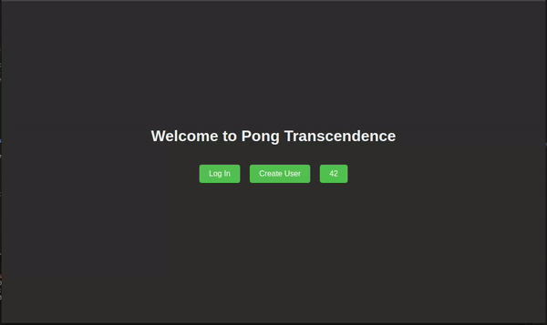

# ft_transcendence
This project is a web application that includes a backend, frontend, and an Nginx server for serving the application. The application is containerized using Docker and can be easily run using Docker Compose.



## Features
- Real-time multiplayer Pong game
- User authentication and profiles
- Tournament system
- Live chat functionality
- Responsive web design

## Prerequisites
Before you begin, ensure you have the following installed on your machine:

- Docker
- Docker Compose

## Getting Started
Follow these steps to get the application up and running:

### 1. Clone the Repository
First, clone the repository to your local machine:
```sh
git clone https://github.com/0xSuitQ/ft_transcendence.git
cd ft_transcendence
```
2. Navigate to the Docker Directory
Navigate to the docker directory where the docker-compose.yml file is located:
``` sh
cd docker
```
3. Run Docker Compose
Run the following command to build and start the Docker containers:
```sh
docker-compose up --build
```

This command will build the Docker images and start the containers for:

Database
Backend server (Django)
Frontend application
Nginx server (reverse proxy)
The frontend is located in nginx/var/www/html
4. Access the Application
Once the containers are up and running, open your browser and navigate to:
```
https://localhost/
```
You should see the application running.

You can view the main script here: [app.js](./nginx/var/www/html/app.js)

You can view the main frontend entry script here: [app.js](./nginx/var/www/html/app.js)

## Stopping the Application
To stop the application, press Ctrl+C in the terminal where docker-compose up is running. Alternatively, you can run the following command in the docker directory:
``` sh
docker-compose down
```
This command will stop and remove the containers.


